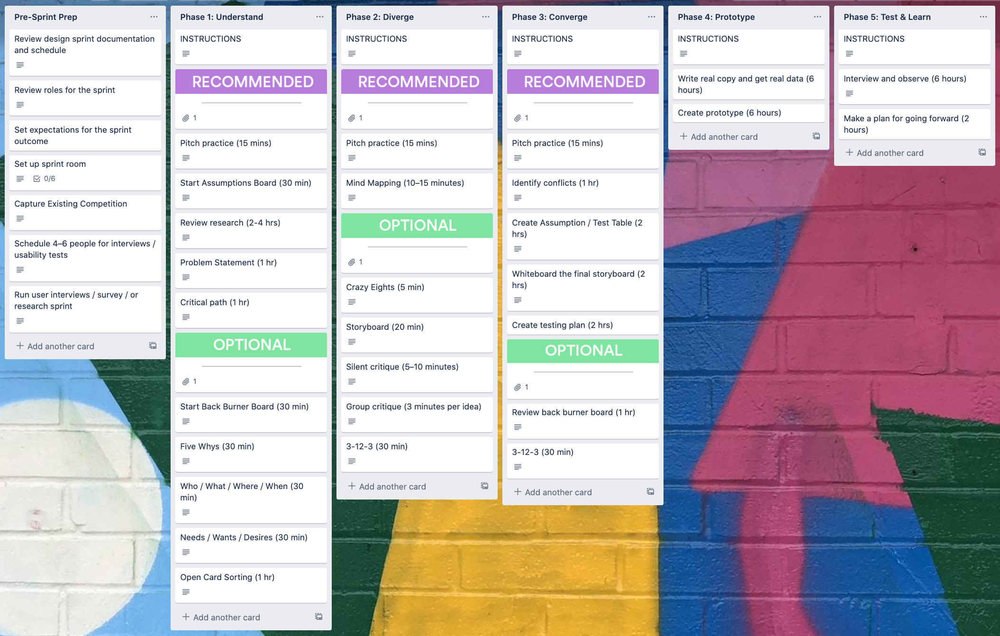

# Kanban

## Backlog | Today | Doing | Blocked | Done

One user story is one card

Card 
Title
Description
Owner
History & chat.

What moves defines flow. Lead time is the time taken by a card to flow through to the end of the activity. 

Commitment point to Delivery point is lead time. 
WIP limits: limit number of tasks in flow. 

## ——————————————————————————————————
## 

## Agile Spring Board

Backlog | Sprint Backlog | In Progress | x.x.xx Sprint

Power Ups: Github, HelpScout
Labels: Meta, Web, Verified on branch, Verified on staging, Bugs, Blocked, Regression, Security Issue

## ——————————————————————————————————
## 

## Bug Reports

Bug Tracking Template | Incoming 🐛 | Mild bugs | Spicy bugs 🐛🌶 | In Progress | Blocked/Waiting | Testing | Merged | Deployed

Labels: Meta, Team Links, Verified on branch, Bugish, Needs translations, High Priority, Regression, Support tools, Waiting on Fixes, Verified on staging, Feature-is, New Team/ boards tab

## ——————————————————————————————————
## 

## Company Overview Template

Teams | Priorities | Current Project | Completed Projects | Bravos

A card was created for each label describing time-bound goals per department

Labels: Product, Marketing, Sales, Support, People, IT

## ——————————————————————————————————
## 

## 

## CRM Pipeline

Contacted Us | Leads | Contacted | Meeting Scheduled | Proposal Delivered | Won | Contact Again | Lost

Contact details of each lead on the card

Labels: Hot, Warm, Cold

## ——————————————————————————————————
## 

## 

## Customer Onboarding

Getting Started | Additional Resources | To do | Doing | Done | FAQs 

Labels: Internal Admin, Resource, Account Manager, New Users, IT Support

## ——————————————————————————————————
**## 

**
## 

## Design Requests Sample

Incoming | Up Next | This Week | Done | In Development/Needs Dev | Back Burner | Ongoing

Labels: Quickie, On hold, Blocked, Meta Page, Branding, Email Design, Content

## ——————————————————————————————————

## Design Sprint 

Pre-Sprint Prep | Phase 1: Understand | Phase 2: Diverge | Phase 3: Converge | Phase 4: Prototype | Phase 5: Test & Learn 

## ——————————————————————————————————

## Editorial Calendar 

Researching | Writing | Editing | Making Graphics | Ready for Publishing | Published

Checklist:
* Blog post is copy edited
* Links are set to open in new page
* Images properly attributed
* Link to helpful articles
* All inbound links have UTM parameters
* Tweets prepared
* Outbound tweets to influencers prepared
* Have all the sample boards been made public.

Power up: Google Drive, Dropbox

## ——————————————————————————————————

## Feature Requests

Inbox | Good Idea High Priority | Good Idea Low Priority | Working On | Up Next | Bad Idea

* Create an actionable inbox to receive and prioritize feature requests from customer-facing teams like Sales, Support and Marketing for your product roadmap.
* Establish a transparent workflow to prioritize feature requests so teams know who to contact and how their request fits on roadmap.
* Transparently share the progress of features selected for development to reduce frequent follow-up inquiries and emails.
* Capture important details about requested features including customer pain points.
* See the frequency of feature requests by asking team members to attach tickets to cards for a better understanding of urgency and popularity of user needs.
* Help improve customer success by letting Sales, Support and Marketing know when a highly requested feature has been released.

## ——————————————————————————————————

## Mise-en-place Personal Productivity System

Today | Tomorrow | This Week | Waiting | Inbox | Done | References

Today - Spend 5-15 minutes each morning planning out the day ahead. Move cards over from Tomorrow, Soon, Waiting, and Inbox, and add your meetings.

Tomorrow - Hold tasks here that won't fit in Today, but should happen soon.

This Week - Add tasks here that should happen by the end of the week.

Waiting - Add stuff here that needs to happen eventually, but hasn't been scheduled yet.

Inbox - Everything should be added here first, before they've been prioritized into the other lists.

Done - This is your trophy room. It feels good to be reminded of all the things you've accomplished!

References - This is your place to keep inspiration and things to remember.

Power Ups - Automation by Zapier, Calendar, Card Repeater, Card Snooze, Dropbox/Google Drive, Package Tracker

## ——————————————————————————————————

## New Hire Onboarding

 Before First Day | On First Day - First Week | Done | Can I have? | Who Do I Talk to About ? | Company Culture | Who’s Who

Labels: Remote Employees, Systems Team, Support Team, Project Requires Design, In Progress

## ——————————————————————————————————

## Product Design Team Sample

What we’re doing | Projects: Active | Project: Upcoming or On Hold | Projects : Shipped | Regular Meetings | Lunch and Learns 

In what we’re doing, each card has 3 checklists: 
* Currently doing 
* Up Next
* Completed

Regular meetings has 3 cards => 
**_### Studio
_****### 

**
Optional informal weekly get together every Monday where a facilitator comes up with an activity. We do warm up exercises, play games, talk nonsense, get real, wonder who shops on 1stdibs.com, compare notes on the poop problem in SF, etc.

**_### Standup 
_****### 

**
Every two weeks the product design team share their current work for team awareness.

When You're Presenting...
---------------------------

We take turns presenting for a few minutes. For product designers, the ideal format goes something like:

- Share your screen

- Briefly explain your design problem

- Talk about any insights or data driving the work

- Help us understand your process

- Say how/where to give feedback

- Ask for a support, a pair designer or a huddle, if desired

That’s it!

While Someone Else is Sharing...
-----------------------------------

- You’re mostly listening and getting info and understanding. You’re not giving feedback or critique in this meeting.

- Keep an eye out for pattern inconsistencies, think about experience unity and overlaps with your own work, and things to follow up on later if any.
**_### 

_**
**_### Huddles
_**
**
**
Huddles on the Design Team 
----

Huddles are how we do critique and also a time for us to get together talking about and developing our work outside of product teams. 

Huddles are groups which stay together for six weeks. Each group has a facilitator, and we take turns to present. We keep groups on the small side - no more than six people. 

The intention is to provide valuable input to the presenter to support and improve their work, and help them solve problems. It is *not* to show how clever we are 😉.

Huddles are structured with conversational turn taking to hear from everyone equally, and avoid group think.

Huddles on Product Teams 
----

Huddles are also a fantastic way for distributed product teams to gather regularly to discuss design, and build relationships. Courtney and Marc have been doing these regularly on Core and Activation with great results so check in with them for advice.

Power Ups: Confluence, Dropbox

## ——————————————————————————————————

## Product Roadmap Template

Ideas | Research & Design | Estimating | Sprint Candidates

### Ideas Template

###Overview of the feature
...
###Business motivation
...

###User stories / Jobs To Be Done

As a < type of user >, I want < some goal > so that < some reason >.

When < situation> I want to < Motivation > so that < Expected outcome >. 
---------

Links to any documentation should be included on the card, or attached to the card, and checklists can be created to track the tasks or user stories to build the feature.

It might also be useful to attach any customers that have requested or would benefit from this feature so that your sales team can reach out to them when it ships.

Tasks Checklist - 1,2,3…

Power Ups : Zendesk, Google Drive, Twitter, HelpScout. Intercom

## ——————————————————————————————————

## Project Overview - New User Experience

New User Experience Projects | Strategy in Progress | Design & Content | Development | Testing/ Translation/Release | Done | Next Up

Labels: Playbook, Home, Team Links, Web Flow Prep, Web Flow, Boards, Emails, Guide

Power ups: Calendar

## ——————————————————————————————————

## Remote Team Meetings

This Week | Previous Meetings | January 25th | January 18th

Kickoff each meeting with a quick update from each team. If anyone else has any questions about something relating to one of the other teams, now is your chance to ask.

Content, Design, Growth, PMM, Community, International.

## ——————————————————————————————————

## Site Reliability

Planning | Issues & Requests | Next Up | Doing | In Code Review | Staging | Prod | Done | Bucket | Recurring 

Labels: Verified in Staging, Ready to Merge, Manual Deploy Steps, Not Shippable, Secrets, Security Issue

### How to use

### Need something? ###

Put a card at the bottom of the `Issues and Requests` list.

####General work flow

- Card added to `Issues and Requests` or `Next Up`.
- Someone on the Systems team assigns themselves to the card, and moves it to `Doing`.
- Code is written and tested against personal envy environment. 
- When ready a Pull Request is created and assigned to another SRE. Card moves to `In Code Review` with a link to the PR attached to it.
- PR discussion ensues.
- The SRE reviewer approves the review (using github approval) and unassigns themselves.
- If PR is from a SRE, merge to `staging` when ready. If an outside contributor, add the yellow *Ready To Merge* label when it is ready to go to staging so an SRE can merge.
- Code is deployed to staging to test, card is moved to `Staging`
- Code testing succeeds, merge and deploy to `prod`, move card to `Prod`.
- Fin.

----

**Planning**

Longer term goals and projects that require further discussion or specification live here.

----

**Issues and Requests**

Represent things that have not yet had work started on the. These cards may come from other teams or be issues observed during other work that need more research.

Cards that sit here for a very long time (month+) are likely to be moved to the bucket.

----

**Next Up**

An organizational tool to help the System team see what the pipeline of work looks like.

## ——————————————————————————————————

## Sprint Retrospectives 

🏆 Went Well | 🚫 Needs To Change | ❓Questions & Discussion | ✅ Action Items

## ——————————————————————————————————

## Team Organisation Central 

Here’s the team | Resources | FAQ | Team Schedules this week | Projects in progress | Up Next 

Labels: Trello Tips, Require Design, Require Copy-editing

## ——————————————————————————————————

## To Dos Eisenhower Matrix style

Incoming | Important/Urgent | Important/Not Urgent | Not important/Urgent | Not Important/Not Urgent | Done

##How Does This Board Work❓

- Start by adding all of your tasks as individual cards on this list, titled "Incoming"
- After you have a bunch of tasks, drag them over to their appropriate lists. Think for a minute about how urgent and how important each task is. 
- Check out the original matrix on which this board is based:

##[Read more about the Eisenhower Matrix Trello board here](https://blog.trello.com/eisenhower-matrix-productivity-tool-trello-board)

