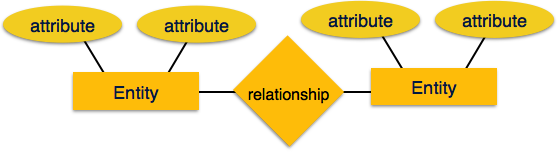
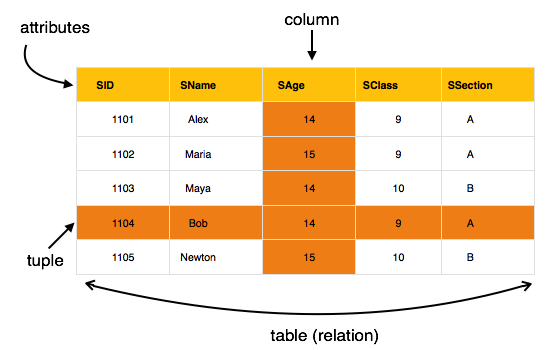
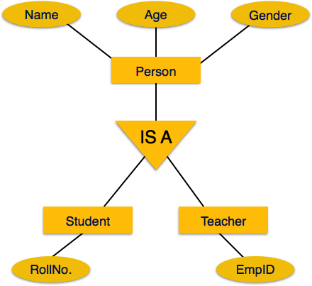

# DBMS

# 

## Overview

**Relation based tables**
DBMS allows entities and relations among them to form tables.

**ACID**

* Atomicity
* Consistency
* Isolation
* Durability

**Isolation of data and application **

A database system is entirely different from its data. A database is an active entity whereas data is said to be passive on which the database works and organises. 

**Less redundancy**

DBMS follows the rules of normalisation which splits a relation when any of its attributes. Normalisation is a mathematically rich and scientific process that reduces data redundancy

**Consistency**
**
**
**Multiuser and Concurrent Access**
**
**
**Multiple Views**
**
**
**Security**
**
**
**## Architecture
**
**3 tier architecture**
Database tier <=> Application tier <=> Presentation tier

## Entity Relationship model

Entities have attributes and there is a relationship between entities.

**Mapping Cardinalities**

1 to 1
1 to many
Many to 1
Many to many

**Relational Model**
**
**

* Data is stored in tables called relations
* Relations can be normalised
* In normalised relations, values saved are atomic values
* Each row in a relation contains a unique value
* Each column in a relation contains values from the same domain.

## Database Schema

Physical database schema
Logical database schema

Database schema is the skeleton of database. Database instances tend to change with time. A DBMS ensures that its every instance is in a valid state, by diligently following all the validations, constrains, and conditions that the database designers have imposed.

Logical data is data about the database.
Physical data independence is the power to change the physical data without impacting the schema or logical data.

## Attributes

**Simple attribute** are atomic values

**Composite attribute** is made up of multiple simple attributes.

**Derived attributes **are those that do not exist in the physical DB but their values are derived from other attributes in the DB. Age can be derived from the date of birth. Average salary can be derived from the list of salaries.

**Single value attributes** contain single values.

**Multi value attributes** may contain one or more values.

They can come together** **as **simple single valued attributes, simple multi valued attributes, composite single valued attributes, composite multi valued attributes**
**
**
**## Entity
**
**
**
**Super key **a set of attributes that collectively identifies an entity in an entity set.

**Candidate key** a minimal super key is called a candidate key. An entity set may have more than one candidate key.

**Primary key** is one of the candidate keys chosen by the database designer to uniquely identify the entity set

The number of entities that define a relationship defines the **degree of the relationship**
**
**
## Generalization Aggregation

Entities are clubbed together. Going up the structure is generalisation

Opposite direction of generalisation is specialisation.

The details of entities are generally hidden from the user. This is called abstraction. 

