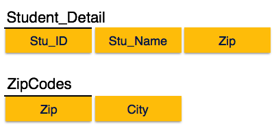

# Normalisation

## Armstrong’s Axiom

**Reflexive rule**
If alpha is set of attributes and beta is_subset_of alpha, the alpha holds beta.

**Augmentation rule**
If a-> b holds and y is attribute set then ay-> by also holds

**Transitivity rule**
If a-> b holds b->c then a-> c

Update anomalies, it may contain anomalies which are like a bad dream for any database administrator. Managing a DB with anomalies is next to impossible.

First normal form
Second normal form
Third normal form

## Boyce Codd normal form

Boyce-Codd Normal Form (BCNF) is an extension of Third Normal Form on strict terms. BCNF states that −
* For any non-trivial functional dependency, X → A, X must be a super-key.

In the above image, Stu_ID is the super-key in the relation Student_Detail and Zip is the super-key in the relation ZipCodes. So,
Stu_ID → Stu_Name, Zip

## Joins

**Left outer join**

The tuple from the left table which doesn’t have a matching value in the right table is excluded in the joined table

**Right outer join**
The tuple from the right table which doesn’t have a matching value in the left table is excluded in the joined table

**Full outer join**

All tuples from left and right tables are matched and the values that don’t exist are assigned null values

