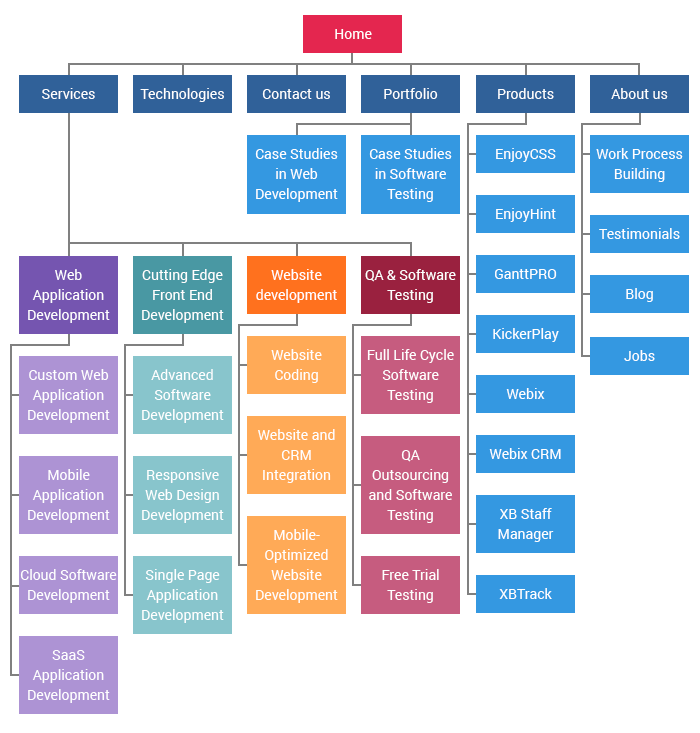
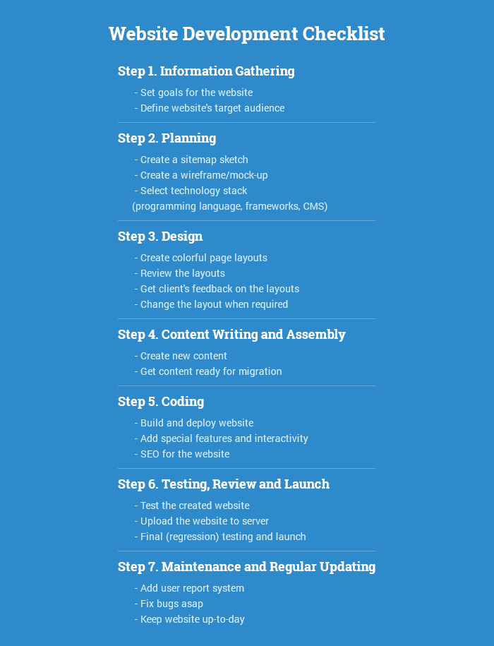
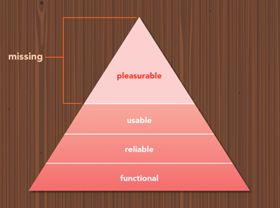

# UX

User Personas

* Where do they live?
* What gender are they?
* What level of education have they achieved?
* What is their income?
* What is their marital status?
* Do they have kids?

* What are their passions and interests?
* What are their dreams and goals?
* Are they politically conservative or liberal?
* What are their personality characteristics?
* What _motivates them _to share information with others?

* What’s their self-image?
* What are their day-to-day worries and goals?
* How are they trying to create a meaningful life?
* What behaviors are they trying to change?

Refined output

* What would create trust in this person?
* What are the top pages they’d view?
* What call-to-actions are they most likely to complete?
* What psychological hurdles would those pages unknowingly present?
* What keywords would they use in google?
* Why would they share our content?

Design User Flows

# 

| **Objective**                     | **Questions**                      |
| --------------------------------- | ---------------------------------- |
| Define the Purpose/               |
| Vision for the Site               | •	What is the purpose of the site? |
| •	What are the goals of the site? |
| Describe the User                 | **Personal**                       |
	•	What is the age of your person?
	•	What is the gender of your person?
	•	What is the highest level of education this person has received?**Professional**
	•	How much work experience does your person have?
	•	What is your person’s professional background?  
	•	Why will they come to the site? (User needs, interests, and goals)
	•	Where (or from whom) else is this person getting information about your issue or similar programs or services?
	•	When and where will users access the site? (User environment and context)**Technical**
	•	What technological devices does your person use on a regular basis?
	•	What software and/or applications does your person use on a regular basis?
	•	Through what technological device does your user primarily access the web for information?
	•	How much time does your person spend browsing the web every day? |
|  User Motivation | •	What is your person motivated by? 
	•	What are they looking for?
	•	What is your person looking to do? 
	•	What are his needs? |

